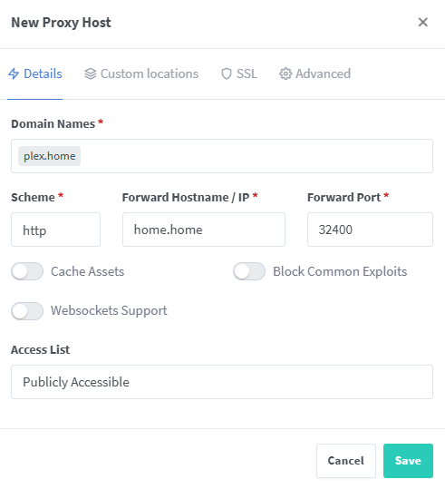

# Setting up local hostnames for home servers on Unifi networks using Nginx Reverse Proxy

## Preamble
I run a Docker server locally which hosts many services such as Plex for watching shows, and Home Assistant for home automation. Because they are both on the same host metal they share the same hostname, but just use different ports to access. For example to access Plex in a browser I would go to `[hostname]:32400`, whereas for Home Assistant I'd use `[hostname]:8123`.

This is all well and good, but means you need to bookmark or memorise the ports, and it's not family friendly if I want someone to be able to access the services without pestering me.

There are guides on how to do this, most feature using a combination of a Raspberry Pi with PiHole + a reverse proxy, and having to update your router's DHCP server to switch the DNS server for all clients to the PiHole. This fails my family-friendly test as if the Raspberry Pi ever goes down (because I tinkered, because there was a power cut and the Raspberry Pi didn't come on by itself etc.), DNS goes down and I will start getting complaints that 'the Internet is down'.

I run a Unifi-based network, which allows me to enter my own DNS records. This, in combination with a reverse proxy, is all you need to make this work. No Raspberry Pi or other hardware is required. This guide details how to do this as simply as possible. It might seem wordy but I hate guides where they assume you know where to find a specific button, so I've tried to be as prescriptive as possible.

If you don't have a Unifi network, you might still be able to make use of this guide, except you will need to figure out for yourself how to edit DNS records for your network.

This guide is correct as of September 2025.

## Version History
- 2025-09-03: Initial Version.
- 2025-09-04: Simplified DNS record steps thanks to a suggestion via Reddit of using wildcard domains (thanks [Kyranak](https://www.reddit.com/r/Ubiquiti/comments/1n7htbx/comment/ncahzly/)). Cleaned up some of the language to clarify that the target of the DNS record is the reverse proxy server, which is not necessarily the same location as the target services like Plex. Made some of the screenshots clearer.
- 2025-09-05: Added workaround for the ELEGOO Centauri Carbon 3D printer web UI.
- 2025-09-24: Added section for ESPHome, rationalised web socket section, added text descriptions for screenshots to aid accessibility, rearranged fixes in alphabetical order.
- 2025-10-07: Added section for NodeRed.

## My Requirements

- If I go to `plex.home`, it should take me to Plex. If I go to `ha.home`, it should take me to Home Assistant.
- If any component in the solution stops working, client devices should continue to operate and be able to access the home servers, and standard Internet name resolution should still work.

## Assumptions
- You are using Unifi as your home network infrastructure and have the ability to log in to the control panel.
- You are familiar with Docker.
- You are familiar with networking concepts like DNS records.
- The new domain names will only be used by people navigating to the services. You _can_ use these new domain names in configuration files etc, but then those service will fail if the proxy server ever goes offline. I prefer to keep everything configured to use IP and port or the real server hostname and port.

# Steps

## Overview
1. Configure a DNS entry in the Unifi control panel.
2. Set up Nginx Proxy Manager using Docker.
3. Configure proxy hosts in Nginx Proxy Manager.
4. Deal with any app specific issues with reverse proxies.

This guide assumes that you want to use `.home` as the TLD for your services, such that you could have `photos.home`, `plex.home` and so on. You could use anything in theory, though I'd advise sticking to reserved TLDs like `.home` and `.local` in case you 'collide' with an actual web address. Note that although `.home` is a real, reserved TLD a lot of browsers don't recognise it and assume you're searching in the address bar. To resolve, make sure you type `http://` before the URL. Or `.local` seems to be better supported, though personally I tend to avoid that one as a lot of services try to publsh their addresses as `.local` and again you could have a collision.

## 1. Configure DNS entries in the Unifi control panel
We're going to set up a DNS 'A record', which tells Unifi how to translate a hostname into an IP, so that when you enter any `.home` address, you will be bounced to the proxy server.

1. Decide where you are going to host the reverse proxy server (i.e. which Docker server) and make a note of its IP address. If you're a small homelab it's likely your reverse proxy server is going on the same instance as all of your other services, but it doesn't have to.
2. Log in to the UniFi console.
3. Go to the settings cog, then `Policy Engine` > `Policy Table`:

3. Click on `Create New Policy`.

4. Select the radio button `DNS` then enter the information as follows, then click `Add`:
    - Type: `Host (A)`.
    - Domain Name: `*.home` (or your other chosen TLD like `*.local`).
    - IP Address: `[the IP address you found in step 1]`.
    - TTL: `Auto`.
 

Now if you go to any of the domains you set up, you'll bounce to whatever's hosted on that server at port 80, rather than where you'd hope. To get this working, we now need a reverse proxy.

## 2. Set up Nginx Proxy Manager using Docker
This service packages up a proxy server in an idiot-proof UI, and runs on Docker. The steps are relatively simple:
1. First, make sure you have nothing running on port 80 on your Docker server. If you have, update your `docker-compose.yml` file to remap the port. Don't use 81 as Nginx Proxy Manager uses it. We will fix this later so you don't have to worry that it's not on the default port. For example, I have the 'Homepage' app set up on port 80, so I edited the `docker-compose.yml` file to remap the port to 82:

2. Follow the install guide for Nginx Proxy Manager found here: https://nginxproxymanager.com/guide/#quick-setup. You can copy/paste the suggested `docker-compose.yml` and it'll work out of the box. Personally in addition I gave the service a name so it's easier to find when doing a `docker ps`, and used real volumes over a bind mount. If you don't know what that means, ignore me.
3. You should now have a running instance of Nginx Proxy Manager. If you go to `home.home` or any other `.home` address, you should get a holding page:

This assumes you have Nginx Proxy Manager running on the same instance as your other services like Plex. If not, go to whatever the IP or hostname is of the instance you installed it on, and you'll get the same page.

## 3. Configure proxy hosts in Nginx Proxy Manager
Now we get into the last main step, of creating the proxy hosts so that everything redirects:
1. Edit the URL to go to `home.home:81`. You should see a login screen like this:

2. Enter the email address as `admin@example.com` and the password as `changeme` and press `Sign In`. You will immediately be asked to reset that login to something more secure - do so.
3. You will now find yourself on the home screen. Click on `Proxy Hosts`:

4. Click on `Add Proxy Host`:

5. Enter the information as follows (ignore anything not specified) then click `Save`:
    - Domain Names: `plex.home` (or whatever service you want to map to).
    - Scheme: `http`.
    - Forward Hostname / IP: `home.home` (or whatever you set up as your A record).
    - Forward Port: `32400` (or whatever the port number is for your service, this one's the default port for Plex).

6. Now in a new browser tab, go to the URL you just created (note if you are following my example, your browser might helpfully redirect you to its search engine rather than navigate to your URL, in which case specifiy `http://` at the start. Once you do this once, you should be fine in future). You should be at the homepage of your service!

7. Repeat steps 4 - 7 for any other domains you want to set up. You might for example want to set up `proxy.home` to bounce to Nginx itself so you don't have to access it via a port, or if you had to change another service that was on port 80 to another port, now's the time to redirect it using a new domain name, for example I switched my homepage instance to `index.home`.
  
Note some apps, like Home Assistant, don't like reverse proxies out of the box, and need additional configuration. Some examples I've encountered are listed in the section below.
   
# 4. Deal with any app specific issues with reverse proxies

## General 502 Bad Gateway Error
If you see this:

It means the reverse proxy has gone to the port you specified, but there's nothing running there. Check you've specified the correct port, and that your service is running on it.

## General WebSockets Fix
A number of applications misbehave unless for the proxy host you've set up, you enable websockets. As of writing these include:

- ESPHome
- Home Assistant
- Immich
- NodeRed
- Zigbee2MQTT

To solve for these apps, complete the following:

1. Log in to Nginx Proxy Manager and go to the `Proxy Hosts` screen where we set up all the domains.
2. Click on the ellipsis next to the relevant entry then click `Edit`:

3. Turn on the toggle for `Websockets Support` and click `Save`:

## ELEGOO Centauri Carbon 3D Printer Web UI
An obscure one, but the fix might be helpful for other apps with a similar problem. Basically this is a Web UI that shows the status of the 3D printer. When you map it to a domain, for example `centauri.home`, you'll notice the UI is blank, and the following error appears in the browser console: `WebSocket connection to 'ws://centauri.home:3030/websocket' failed:`.

Turning on Web Sockets support doesn't seem to resolve this. To resolve, we need to create a 'stream' and also open up another port on the Docker instance:

1.  Log in to Nginx Proxy Manager and go to the `Streams` screen:

2. Click on the `Add Stream` button:

3. Enter the fields as follows and click save:
  - Incoming Port: `3030`.
  - Forward Host: `[IP address of the printer]`.
  - Forward Port: `3030`.
  - TCP Forwarding: `Enabled`.
  - UDP Forwarding: `Disabled`.

4. Now we need to edit the `docker-compose.yml` file for your Nginx Proxy Manager and add a mapping from port 3030, to port 3030:

Don't forget to 'down' and 'up' the instance to make the change stick.

This should now be working fine. Do note this solution will forward _any_ traffic sent to Nginx Proxy Manager on port 3030 to the 3D printer, so be aware in case you have another server that needs that port.

## ESPHome
The home page will display, but you won't be able to connect to any devices. Enable web sockets as per the guide above.

## Home Assistant
If you try to go to your configured Home Assistant domain, such as `ha.home`, you'll be greeted with the error `400: Bad Request`, and the following entry in your logs:

Note in my case the address range it's complaining about is not that of my local network or client machine, I assume this is some internal IP mapping the reverse proxy is doing.

To resolve, we need to edit the `configuration.yml` file for Home Assistant, and change a setting in Nginx Proxy Manager.

### Changes to configuration.yml
1. Edit your `configuration.yml` according to your own Home Assistant configuration. For example as I am running HA Core, I have to SSH into the docker instance and edit it using VI.
2. Follow the steps here: https://www.home-assistant.io/integrations/http#reverse-proxies. Note for the IP to specify, I tried using the known IP of my server, but I still kept getting the error. Instead I entered the 172 address I saw in the error logs, and it's working!
3. Validate your changes are valid using configuration checker, then restart Home Assistant:

If you try again, you'll get a different error:

Follow on to the next section to resolve.

### Enable Websockets Support in Nginx Proxy Manager
Follow the section above on the WebSockets fix, then you should now be able to go to `ha.home` and correctly see the Home Assistant homepage.

## Immich
You will get a generic bad gateway error. Enable web sockets as per the guide above.

## NodeRed
The site will appear to load, but quickly you'll get a could not connect to server pop-up. Enable web sockets as per the guide above.

## qBittorrent
You get a very simple error of `Unauthorized`. A small change is required in the qBittorrent client:

1. Navigate to the qBittorrent client interface using the classic hostname and port and log in.
2. Go to `Settings` > `WebUI`> `Security`, uncheck `Enable Cross-Site Request Forgery (CSRF) protection` and click `Save`.

## Zigbee2MQTT
At first glance it might look like Zizbee2MQTT is working out of the box, but you'll quickly see all your devices are missing!

To resolve, enable web sockets as per the guide above.

